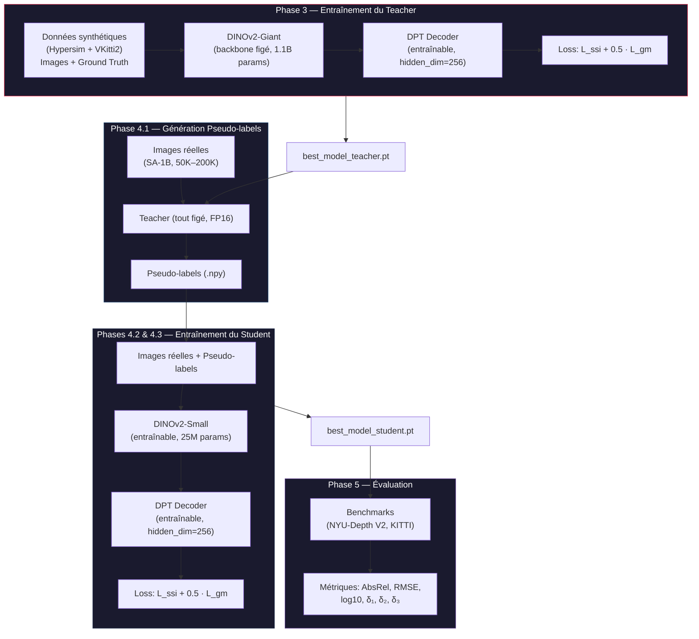
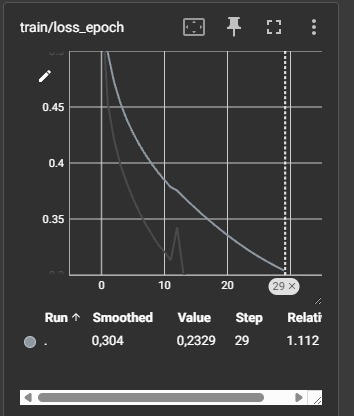
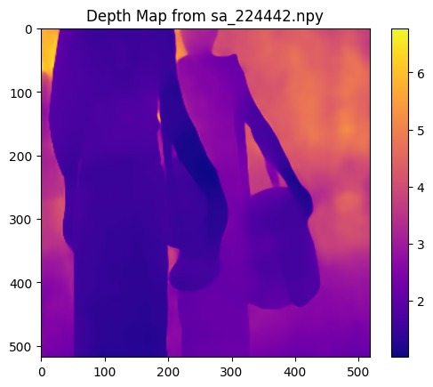
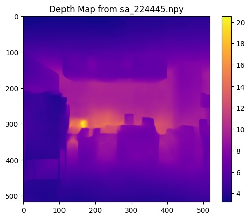
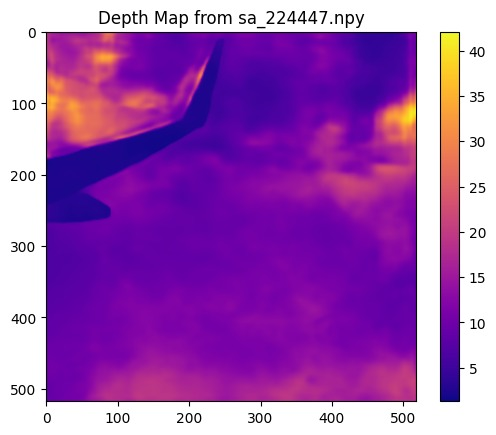
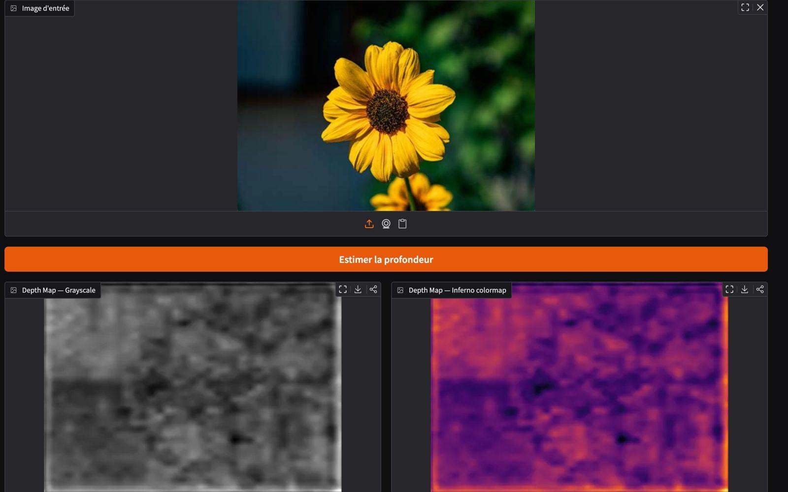
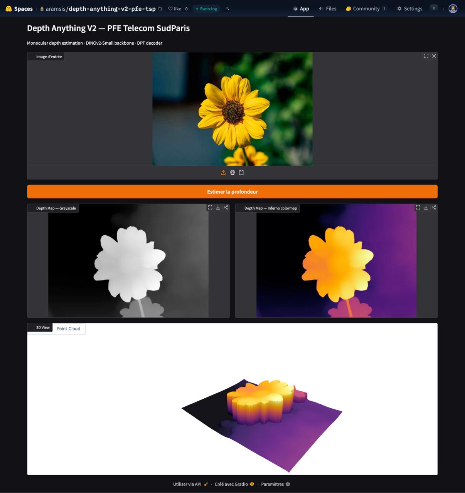

# Depth Anything V2 — Projet de Fin d'Etudes

> Reproduction partielle du pipeline Depth Anything V2 : distillation de connaissance d'un Teacher DINOv2-Giant (1,1 milliard de parametres) vers un Student DINOv2-Small (25 M parametres) pour l'estimation de profondeur monoculaire en temps reel.

**Auteurs :** *Pierlouis Pillet ; Adam Ramsis ; Rodrick Zegang*  
**Encadrant :** *Julien Romero*  
**Institution :** Telecom SudParis — Annee universitaire 2025-2026  
**Duree du projet :** 26 semaines — Cluster SLURM Arcadia (NVIDIA H100 NVL)
---

## Table des matieres

- [Presentation](#presentation)
- [Contexte scientifique](#contexte-scientifique)
- [Architecture](#architecture)
- [Stack technique](#stack-technique)
- [Demarrage rapide](#demarrage-rapide)
- [Variables d'environnement](#variables-denvironnement)
- [Structure du projet](#structure-du-projet)
- [Resultats](#resultats)
- [Objectifs et analyse de performance](#objectifs-et-analyse-de-performance)
- [Contribution et licence](#contribution-et-licence)
- [References](#references)

---

## Presentation

Ce projet de fin d'etudes reproduit la methode [Depth Anything V2](https://arxiv.org/abs/2406.09414) pour l'**estimation de profondeur monoculaire** par distillation de connaissance. A partir d'une seule image RGB, le modele predit une carte de profondeur dense et precise — sans capteur LiDAR ni paire d'images stereo au moment de l'inference.

Le Teacher (DINOv2-Giant + DPT, backbone fige) est entraine sur des donnees synthetiques annotees (Hypersim, Virtual KITTI 2), puis genere des pseudo-labels sur des images reelles non etiquetees (SA-1B). Le Student (DINOv2-Small + DPT, entierement entrainable) apprend exclusivement a partir de ces pseudo-labels, eliminant tout biais de domaine synthetique. Le projet cible un cluster HPC SLURM avec GPU NVIDIA H100 et vise les metriques publiees dans le papier original (AbsRel < 0,08, delta1 > 0,95 sur NYU-Depth V2).

---

## Contexte scientifique

Ce projet s'inscrit dans la continuite des travaux de Yang et al. (2024) sur l'estimation de profondeur monoculaire (MDE). Le papier Depth Anything V2 identifie trois pratiques cles pour construire un modele MDE performant :

1. **Remplacement des images reelles etiquetees par des images synthetiques.** Les images reelles etiquetees souffrent de bruit d'etiquette (erreurs de capteurs de profondeur, correspondance stereo, SfM) et de details ignores (estimations grossieres). Les images synthetiques offrent des annotations de profondeur parfaitement precises, capturant les maillages fins, les objets transparents et les surfaces reflechissantes.

2. **Augmentation de la capacite du modele Teacher.** Seul le modele DINOv2-Giant (1,3B parametres) parvient a se transferer avec succes du domaine synthetique au domaine reel. Un modele plus petit echoue en raison de l'ecart de distribution entre images synthetiques (trop "propres") et images reelles, ainsi que de la couverture limitee des scenes synthetiques.

3. **Distillation via des pseudo-labels a grande echelle.** Le Teacher genere des pseudo-etiquettes de profondeur sur des images reelles non etiquetees. Les modeles Student sont ensuite entraines exclusivement sur ces pseudo-labels, ce qui permet de (a) combler l'ecart de domaine synthetique-reel, (b) augmenter la couverture des scenes, et (c) transferer les connaissances du Teacher vers des modeles plus legers de maniere robuste. La distillation au niveau de la prediction (et non au niveau des features) est jugee plus sure lorsque le ratio de parametres Teacher/Student est important.

Le pipeline global se decompose en trois etapes : entrainement du Teacher sur images synthetiques, generation de pseudo-labels sur images reelles non etiquetees, puis entrainement des Students sur ces pseudo-labels. L'entrainement utilise une perte invariante a l'echelle et au decalage ($\mathcal{L}_{ssi}$) combinee a une perte de correspondance de gradient ($\mathcal{L}_{gm}$), cette derniere ameliorant la nettete des predictions de profondeur.

---

## Architecture

### Pipeline global Teacher–Student

Le système suit un pipeline en quatre grandes étapes exécutées séquentiellement. Chaque phase produit un artefact consommé par la suivante, formant une chaîne de dépendance stricte : données synthétiques → Teacher → pseudo-labels → Student → évaluation.



### Backbone : DINOv2

Le backbone est un Vision Transformer (ViT) pré-entraîné par auto-supervision ([DINOv2, Facebook Research](https://github.com/facebookresearch/dinov2)), chargé via `torch.hub`. Il découpe chaque image en patches de 14×14 pixels et produit des features multi-échelle extraites à quatre couches intermédiaires régulièrement espacées. Pour une image de 518×518 pixels (résolution choisie car 518 = 37 × 14), cela génère 37×37 = 1 369 tokens par couche.

- **Teacher** : variante Giant (`dinov2_vitg14`) — 1 536 dimensions d'embedding, 40 couches Transformer, ~1,1 milliard de paramètres. Le backbone est **entièrement figé** pendant l'entraînement : seul le décodeur DPT apprend.
- **Student** : variante Small (`dinov2_vits14`) — 384 dimensions, 12 couches, ~25 millions de paramètres. Le backbone est **entraînable** par défaut (optionnellement figeable via `--freeze_backbone`).

### Décodeur : DPT (Dense Prediction Transformer)

Le décodeur DPT (implémentation custom dans `src/models/decoder.py`) reçoit les quatre sorties multi-échelle du backbone et les transforme en une carte de profondeur dense :

1. **Reassemble Blocks** — Projection 1×1 conv vers un espace commun (`hidden_dim=256`) + interpolation bilinéaire avec facteurs d'échelle progressifs (×4, ×2, ×1, ×0.5).
2. **Fusion Blocks** — Fusion **bottom-up** : les features les plus profondes (résolution la plus basse) sont progressivement combinées avec les features plus superficielles via Conv3×3 + BN + ReLU + résidu + upsampling ×2.
3. **Head** — `Conv3×3 → ReLU → Conv1×1 → ReLU` produisant une carte `[B, 1, H, W]`. L'activation ReLU finale garantit la positivité des prédictions de profondeur.

L'architecture DPT est **identique** entre Teacher et Student (même structure, mêmes hyperparamètres) — seule la dimension d'entrée change (1 536 vs 384).

### Fonctions de perte

Deux pertes complémentaires sont combinées, reproduisant fidèlement la Section 7.1 du papier :

- **$\mathcal{L}_{ssi}$ (Scale-and-Shift Invariant Loss)** — Invariante au facteur d'échelle et au décalage, calculée en espace log-profondeur : $\sqrt{\frac{1}{n}\sum d_i^2 - \frac{\lambda}{n^2}(\sum d_i)^2}$ où $d_i = \log(\hat{y}_i) - \log(y_i)$. Un masquage **Top-K** (10% des pixels avec les erreurs les plus élevées) améliore la robustesse aux outliers. Stabilité numérique : `sqrt(clamp(min=0) + eps)`.
- **$\mathcal{L}_{gm}$ (Gradient Matching Loss)** — Force la reproduction des discontinuités de profondeur via des filtres de Sobel 3×3 (horizontaux + verticaux), opérant en espace log pour garantir l'invariance d'échelle. Distance L1 entre gradients prédits et cibles.
- **Perte totale** : $\mathcal{L} = \mathcal{L}_{ssi} + 0.5 \cdot \mathcal{L}_{gm}$

### Décisions de conception clés

| Décision | Justification |
|----------|---------------|
| **Distillation au niveau prédiction** (pas feature-level) | Le ratio de paramètres Teacher/Student est de 44× — un alignement feature-level serait instable |
| **Student jamais exposé aux données synthétiques** | Élimine le domain gap syn→réel ; le Teacher "absorbe" le domaine synthétique |
| **Backbone figé pour le Teacher** | DINOv2-Giant est déjà un extracteur de features SOTA ; fine-tuner 1,1B params serait prohibitif en VRAM |
| **Paired transforms** pour image + depth | Garantit la cohérence spatiale des augmentations (flip, crop) entre entrée et cible |
| **Cosine LR avec reset** (v4) | Permet de découper l'entraînement en cycles (20 epochs v3, puis 20 epochs v4 à LR réduit) |
| **Resume-aware everywhere** | Pseudo-labels, téléchargements et checkpoints supportent tous la reprise après interruption |

---

## Stack technique

| Couche | Technologie | Version | Rôle dans le projet |
|--------|-------------|---------|---------------------|
| Framework DL | PyTorch | ≥ 2.0 | Entraînement, inférence, AMP, `torch.compile` |
| Vision Transformers | torchvision | ≥ 0.15 | Preprocessing, utilitaires |
| Backbone pré-entraîné | DINOv2 (`torch.hub`) | — | Extraction features multi-échelle (Giant + Small) |
| Modèles ViT | TIMM | ≥ 0.9 | Architecture ViT et poids pré-entraînés |
| Tokenizers/Modèles | HuggingFace Transformers | ≥ 4.30 | Accès alternatif aux variantes ViT |
| Traitement image | OpenCV, Pillow, scikit-image | ≥ 4.8, ≥ 10.0, ≥ 0.21 | Pipeline de preprocessing et augmentations |
| Calcul scientifique | NumPy, SciPy, pandas | ≥ 1.24, ≥ 1.11, ≥ 2.0 | Manipulation tenseurs, statistiques, pseudo-labels |
| Visualisation | Matplotlib | ≥ 3.7 | Depth maps, courbes de loss, error maps |
| Monitoring | TensorBoard, Weights & Biases | ≥ 2.14, ≥ 0.15 | Suivi temps réel des métriques |
| Configuration | PyYAML + OmegaConf | ≥ 6.0, ≥ 2.3 | Configs YAML structurées, surcharge CLI |
| Data versioning | DVC | ≥ 3.0 | Séparation code / datasets volumineux |
| Tensor ops | einops | ≥ 0.6 | Réarrangement de tenseurs lisible |
| Tests | pytest + pytest-cov | ≥ 7.4, ≥ 4.1 | Tests unitaires et couverture |
| HPC | SLURM | — | Orchestration GPU H100, jobs batch, notification mail |
| Notebooks | Jupyter + ipywidgets | ≥ 1.0, ≥ 8.0 | Exploration interactive et monitoring |

---

## Demarrage rapide

### Prérequis

- **Python** ≥ 3.10
- **CUDA** ≥ 11.8 et un GPU NVIDIA (H100 recommandé pour l'entraînement complet ; un GPU ≥ 8 Go VRAM suffit pour l'inférence)
- **Git**
- *(Optionnel)* Accès à un cluster SLURM pour lancer les jobs d'entraînement

### Installation & Exécution

```bash
# 1. Cloner le dépôt
git clone https://github.com/pl-plt/Monocular-Depth-Vision-PFE.git
cd Monocular-Depth-Vision-PFE

# 2. Créer et activer l'environnement virtuel
python -m venv venv
source venv/bin/activate          # Linux / macOS
# venv\Scripts\activate           # Windows

# 3. Installer les dépendances
pip install -r requirements.txt

# 4. Vérifier le GPU
python -c "import torch; print(f'CUDA: {torch.cuda.is_available()}'); print(f'GPU: {torch.cuda.get_device_name(0)}')"
```

#### Téléchargement des données

```bash
# Via le dispatcher (toutes les sources)
python scripts/download_data.py --dataset all

# Ou dataset par dataset
python scripts/download_hypersim.py --output_dir datasets/synthetic/hypersim --max_scenes 50
python scripts/download_vkitti2.py --output_dir datasets/synthetic/vkitti2
python scripts/download_sa1b.py --n_tars 4
python scripts/download_nyu_test.py --output_dir datasets/benchmarks/nyu_depth_v2
python scripts/download_indoor_images.py --dataset all

# Sur cluster SLURM (recommandé)
sbatch scripts/slurm/download_hypersim.slurm
sbatch scripts/slurm/download_vkitti2.slurm
sbatch scripts/slurm/download_sa1b.slurm
sbatch scripts/slurm/download_nyu_test.slurm
```

#### Entraîner le Teacher (Phase 3)

```bash
python scripts/train_teacher.py \
    --dataset_dir datasets/synthetic/hypersim \
    --dataset_dirs datasets/synthetic/hypersim datasets/synthetic/vkitti2 \
    --epochs 20 --batch_size 4 --lr 1e-4 --amp

# Sur SLURM
sbatch scripts/slurm/train_teacher_v3.slurm
```

#### Générer les pseudo-labels (Phase 4.1)

```bash
python scripts/generate_pseudo_labels.py \
    --teacher_weights outputs/checkpoints/teacher/best_model.pt \
    --images_dir datasets/real_unlabeled/sa1b \
    --output_dir outputs/pseudo_labels \
    --batch_size 16 --half --quality_check

# Sur SLURM
sbatch scripts/slurm/generate_pseudo_labels_v3.slurm
```

#### Entraîner le Student (Phases 4.2 & 4.3)

```bash
# Phase 4.2 — Entraînement initial (50K images, 20 epochs)
python scripts/train.py \
    --images_dir datasets/real_unlabeled/sa1b \
    --pseudo_labels_dir outputs/pseudo_labels \
    --backbone dinov2_vits14 --epochs 20 --batch_size 16 --lr 1e-4

# Phase 4.3 — Scale-up (200K images, reprise avec cosine LR reset)
python scripts/train.py \
    --images_dir datasets/real_unlabeled/sa1b \
    --pseudo_labels_dir outputs/pseudo_labels \
    --resume outputs/checkpoints/student/best_model.pt \
    --reset_scheduler --lr 5e-5 --epochs 20

# Sur SLURM (version courante v4)
sbatch scripts/slurm/train_student_v4.slurm
```

#### Évaluer le modèle (Phase 5)

```bash
python scripts/evaluate.py \
    --checkpoint outputs/checkpoints/student/best_model.pt \
    --backbone dinov2_vits14 \
    --nyu_dir datasets/benchmarks/nyu_depth_v2 \
    --kitti_dir datasets/benchmarks/kitti

# Sur SLURM
sbatch scripts/slurm/evaluate.slurm
```

#### Inférence rapide

```bash
python scripts/run_inference.py \
    --images_dir chemin/vers/images/ \
    --weights outputs/checkpoints/student/best_model.pt
```

### Tests

```bash
# Suite complète avec couverture
pytest tests/ -v --cov=src --cov-report=term-missing

# Tests individuels
pytest tests/test_models.py -v     # DPT decoder (shapes, fusion order, positivity)
pytest tests/test_losses.py -v     # L_ssi, L_gm, combined loss
pytest tests/test_metrics.py -v    # AbsRel, RMSE, δ thresholds
pytest tests/test_data.py -v       # Transforms, preprocessing, splits
```

> **Note :** Les tests utilisent des tenseurs synthétiques — aucune donnée réelle ni modèle pré-entraîné n'est requis.

---

## Variables d'environnement

Aucun fichier `.env` n'est requis. Les chemins et hyperparamètres sont gérés via les fichiers YAML dans `configs/`. Les variables suivantes sont optionnelles :

| Variable | Description | Valeur par défaut |
|----------|-------------|-------------------|
| `WANDB_API_KEY` | Clé API Weights & Biases (monitoring optionnel) | _(non définie — TensorBoard utilisé par défaut)_ |
| `WANDB_PROJECT` | Nom du projet W&B | `depth-anything-v2-pfe` |
| `CUDA_VISIBLE_DEVICES` | Sélection du GPU à utiliser | _(toutes les GPUs visibles)_ |
| `PYTHONUNBUFFERED` | Flush stdout immédiat (critique pour logs SLURM) | `1` (défini automatiquement par les scripts) |
| `PYTHONPATH` | Doit inclure la racine du projet | `.` |

> **Note SLURM :** Sur le cluster, les variables sont déclarées directement dans les scripts `.slurm` via des directives `#SBATCH` ou des `export` bash. Les variables SLURM automatiques (`SLURM_JOB_ID`, `SLURM_CPUS_PER_TASK`, `SLURM_NODELIST`) sont utilisées pour le logging et la configuration des DataLoaders.

---

## Structure du projet

```
Monocular-Depth-Vision-PFE/
│
├── configs/                            # Configuration YAML (source de vérité pour les hyperparamètres)
│   ├── train_config.yaml               #   Modèle, loss, optimizer, scheduler, phases 4.2 & 4.3
│   ├── data_config.yaml                #   Datasets, preprocessing, augmentations, dataloader
│   └── eval_config.yaml                #   Benchmarks, métriques, cibles PFE, résultats de référence
│
├── src/                                # Code source principal (package Python)
│   ├── models/                         #   Architecture du réseau
│   │   ├── backbone.py                 #     Wrapper DINOv2 — extraction features multi-échelle (4 couches)
│   │   ├── decoder.py                  #     Décodeur DPT — ReassembleBlocks + FusionBlocks + Head
│   │   ├── teacher.py                  #     TeacherModel — Giant backbone figé + DPT entraînable
│   │   └── student.py                  #     StudentModel — Small backbone entraînable + DPT
│   ├── losses/                         #   Fonctions de perte
│   │   ├── scale_invariant.py          #     L_ssi — log-space, Top-K masking, invariance échelle+shift
│   │   └── gradient_matching.py        #     L_gm — Sobel, log-space + DepthAnythingLoss combinée
│   ├── data/                           #   Pipeline de données
│   │   ├── datasets.py                 #     SyntheticDepthDataset, PseudoLabeledDataset, EvaluationDataset
│   │   ├── transforms.py              #     TrainTransform (flip, crop, jitter) & EvalTransform (paired)
│   │   ├── preprocessing.py           #     Validation images/depth, train/val split, stats
│   │   └── download.py                #     Utilitaires de téléchargement (stubs → scripts dédiés)
│   ├── training/                       #   Boucle d'entraînement
│   │   ├── trainer.py                  #     AdamW, CosineAnnealingLR, AMP, early stopping, checkpoints
│   │   ├── distillation.py            #     DistillationPipeline — orchestre pseudo-labels + training
│   │   └── pseudo_labels.py           #     PseudoLabelGenerator — inférence Teacher batch, FP16, resume
│   ├── evaluation/                     #   Évaluation et visualisation
│   │   ├── metrics.py                  #     DepthMetrics — AbsRel, RMSE, log10, δ₁/₂/₃, median scaling
│   │   ├── benchmark.py               #     BenchmarkEvaluator — NYU & KITTI configs, gap vs official
│   │   └── visualization.py           #     DepthVisualizer — depth maps, comparisons, error maps, plots
│   └── utils/                          #   Utilitaires transversaux
│       ├── helpers.py                  #     Seed, device detection, timer, param count
│       ├── checkpoint.py              #     Save/load checkpoints, rotation des 5 derniers
│       └── logging_utils.py           #     Setup TensorBoard / W&B, log scalars & images
│
├── scripts/                            # Points d'entrée CLI (argparse)
│   ├── run_inference.py                #   Phase 0 — Inférence baseline
│   ├── extract_features.py            #   Phase 1 — Exploration features DINOv2
│   ├── download_data.py               #   Phase 2 — Dispatcher téléchargement (--dataset {all,...})
│   ├── download_hypersim.py           #   Phase 2 — Hypersim (HDF5 → PNG+NPY, threaded, resume)
│   ├── download_vkitti2.py            #   Phase 2 — Virtual KITTI 2 (TAR → JPG+NPY)
│   ├── download_sa1b.py               #   Phase 2 — SA-1B (Meta, TAR, configurable n_tars)
│   ├── download_indoor_images.py      #   Phase 2 — NYU train + SUN RGB-D + DA-2K
│   ├── download_nyu_test.py           #   Phase 2 — NYU-Depth V2 Eigen test set (MAT → PNG+NPY)
│   ├── train_teacher.py               #   Phase 3 — Entraînement Teacher (multi-source, AMP)
│   ├── generate_pseudo_labels.py      #   Phase 4.1 — Génération pseudo-labels (FP16, quality check)
│   ├── train.py                        #   Phases 4.2–4.3 — Entraînement Student (resume, LR reset)
│   ├── evaluate.py                     #   Phase 5 — Évaluation benchmarks NYU + KITTI
│   └── slurm/                          #   Jobs SLURM pour cluster H100 (partition: normal)
│       ├── train_student_v4.slurm      #     Version courante — 20 epochs, cosine LR reset, 64G RAM
│       ├── train_student_v3.slurm      #     Entraînement v3 (5 bugfixes majeurs)
│       ├── train_teacher_v3.slurm      #     Teacher v3 (AMP, 8 workers, 60G RAM)
│       ├── generate_pseudo_labels_v3.slurm
│       ├── evaluate.slurm
│       └── download_*.slurm            #     Un script par dataset (CPU-only, 4–16G RAM)
│
├── notebooks/                          # Jupyter notebooks d'exploration
│   ├── 01_baseline_inference.ipynb     #   Inférence avec modèle officiel pré-entraîné
│   ├── 02_dinov2_exploration.ipynb     #   Visualisation features DINOv2 multi-échelle
│   ├── 03_data_exploration.ipynb       #   Analyse des datasets (distribution, qualité)
│   ├── 04_training_monitoring.ipynb    #   Monitoring live des runs TensorBoard/W&B
│   └── 05_evaluation_analysis.ipynb    #   Analyse métriques, comparaison vs papier
│
├── tests/                              # Tests unitaires (pytest, tenseurs synthétiques)
│   ├── test_models.py                  #   ReassembleBlock, FusionBlock, DPTDecoder shapes/fusion
│   ├── test_losses.py                  #   L_ssi, L_gm, combined, gradient flow, top-K masking
│   ├── test_metrics.py                 #   DepthMetrics (perfect pred, δ ordering, median scaling)
│   └── test_data.py                    #   Transforms (shape, determinism), splits
│
├── docs/                               # Documentation technique
│   ├── architecture.md                 #   Description détaillée Teacher–Student
│   ├── data_manifest.json              #   Registre des datasets (format, taille, URL)
│   ├── Roadmap Projet Depth Anything V2.md
│   └── Summary DepthAnythingV2 paper.md
│
├── datasets/                           # Données (gitignored, ~500 Go potentiel)
│   ├── synthetic/                      #   hypersim/ + vkitti2/ (images + ground truth depth)
│   ├── real_unlabeled/                 #   sa1b/ (50K → 200K → 500K images JPG)
│   └── benchmarks/                     #   nyu_depth_v2/ + kitti/ (test sets)
│
├── outputs/                            # Résultats (gitignored)
│   ├── checkpoints/                    #   Poids .pt (teacher/ + student/, rotation 5 derniers)
│   ├── logs/                           #   Logs TensorBoard
│   ├── pseudo_labels/                  #   Prédictions Teacher (.npy float32 ou .png uint16)
│   └── visualizations/                 #   Depth maps, comparisons, error maps exportées
│
├── requirements.txt                    # Dépendances Python (pip)
└── README.md
```

---

## Resultats

### Courbes d'entrainement

Les courbes ci-dessous montrent l'evolution de la loss (train et validation) au fil des epochs pour l'entrainement du Student.



*Figure 1 — Evolution de la loss d'entrainement et de validation par epoch du student (TensorBoard).*

### Resultats des prédictions de notre teacher (DINOv2-Giant + DPT) sur des images de validation :





*Figure 2 — Image RGB, Ground Truth, prediction Teacher (DINOv2-Giant).*

### Metriques d'evaluation sur NYU-Depth V2

Resultats obtenus par le Student (DINOv2-Small + DPT) sur le test set NYU-Depth V2 (Eigen split, 654 images) :

| Metrique | Valeur obtenue | Objectif minimum | Ref. DAv2-Small (papier) |
|----------|:--------------:|:----------------:|:------------------------:|
| AbsRel   | 0,236          | < 0,080          | 0,053                    |
| RMSE     | 0,778          | —                | —                        |
| log10    | 0,093          | —                | —                        |
| delta1   | 0,643          | > 0,950          | 0,992                    |
| delta2   | 0,881          | —                | —                        |
| delta3   | 0,957          | —                | —                        |

> **Analyse :** Les performances actuelles restent en retrait par rapport aux cibles du papier original. L'ecart s'explique principalement par le volume limite de donnees de pseudo-labels utilise (quelques milliers d'images vs 62M dans le papier), le nombre reduit d'iterations d'entrainement, et l'absence de fine-tuning metrique. Ces resultats constituent une base fonctionnelle a ameliorer.

### Exemples d'inference et comparaison avec le papier original

Exemples de predictions du Student sur des images :



*Figure 4 — Predictions du Student Entrainé sur une image benchmark.*



*Figure 5 — Predictions du Student du papier sur la même image.*

---

## Objectifs et analyse de performance

Objectifs definis dans `configs/eval_config.yaml` par rapport au papier original :

| Niveau | Critere | AbsRel (NYU) | delta1 (NYU) | Ecart vs DAv2-Small |
|--------|---------|:------------:|:--------:|:-------------------:|
| **Minimum** (>= 12/20) | Modele fonctionnel | < 0,080 | > 0,950 | < 30 % |
| **Intermediaire** (>= 14/20) | 2 benchmarks completes | < 0,065 | > 0,970 | < 20 % |
| **Excellence** (>= 16/20) | + etudes d'ablation | < 0,061 | > 0,980 | < 15 % |
| **Ref. DAv2-Small** | Papier original | 0,053 | 0,992 | — |
| **Ref. DAv2-Giant** | Papier original | 0,038 | 0,996 | — |

### Pistes d'amelioration identifiees

- Augmenter le volume de pseudo-labels (objectif : 50K-200K images SA-1B, vs quelques milliers actuellement)
- Augmenter le nombre d'iterations d'entrainement (480K iterations dans le papier)
- Ajouter des datasets synthetiques supplementaires (BlendedMVS, IRS, TartanAir) utilises dans le papier
- Appliquer un fine-tuning metrique pour l'estimation de profondeur absolue
- Explorer le surchantillonnage de resolution au moment du test (cf. Appendice B du papier)

---

## Contribution et licence

### Contribuer

1. **Fork** le depot
2. Creer une branche feature : `git checkout -b feat/ma-fonctionnalite`
3. Commiter avec des messages clairs : `git commit -m "feat: ajout de ma fonctionnalite"`
4. Pousser la branche : `git push origin feat/ma-fonctionnalite`
5. Ouvrir une **Pull Request** vers `main`

Conventions de commit : `feat:`, `fix:`, `docs:`, `test:`, `refactor:`.

### Licence

Ce projet est developpe dans un cadre academique (Projet de Fin d'Etudes, Telecom SudParis). Le code source est place sous licence MIT. Les poids pre-entraines DINOv2 sont soumis a la licence Apache 2.0 de Meta/Facebook Research. Les datasets utilises sont soumis a leurs licences respectives (cf. section References).

---

## References

- Yang, L., Kang, B., Huang, Z., et al. — [Depth Anything V2](https://arxiv.org/abs/2406.09414), 2024
- [Depth Anything V2 — Code officiel](https://github.com/DepthAnything/Depth-Anything-V2)
- Oquab, M., et al. — [DINOv2: Learning Robust Visual Features](https://arxiv.org/abs/2304.07193), Facebook Research, 2023 · [Code](https://github.com/facebookresearch/dinov2)
- Ranftl, R., Bochkovskiy, A., Koltun, V. — [Vision Transformers for Dense Prediction (DPT)](https://arxiv.org/abs/2103.13413), 2021 · [Code](https://github.com/isl-org/DPT)
- **Datasets** : [Hypersim (Apple)](https://github.com/apple/ml-hypersim) · [Virtual KITTI 2 (NAVER Labs)](https://europe.naverlabs.com/research/computer-vision/proxy-virtual-worlds-vkitti-2/) · [SA-1B (Meta)](https://ai.meta.com/datasets/segment-anything/) · [NYU-Depth V2](https://cs.nyu.edu/~silberman/datasets/nyu_depth_v2.html) · [KITTI](https://www.cvlibs.net/datasets/kitti/)

---

<p align="center"><em>Projet de Fin d'Etudes — Telecom SudParis — Reproduction partielle de Depth Anything V2<br/>Hardware cible : NVIDIA H100 NVL — Cluster SLURM (Arcadia) — Duree : 26 semaines</em></p>
